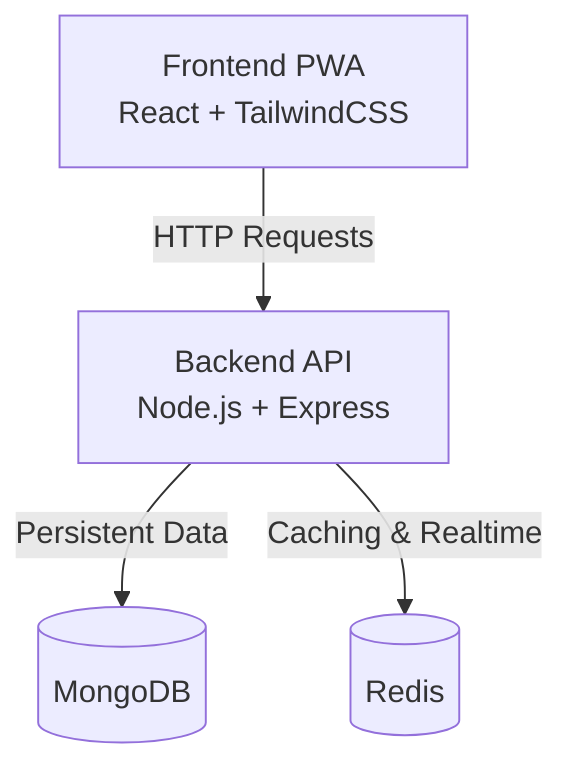
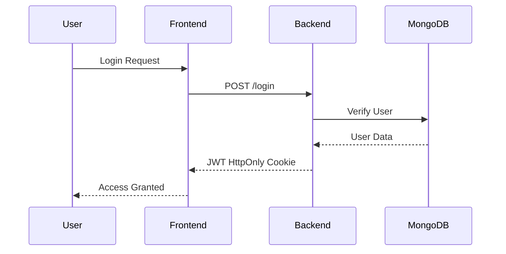
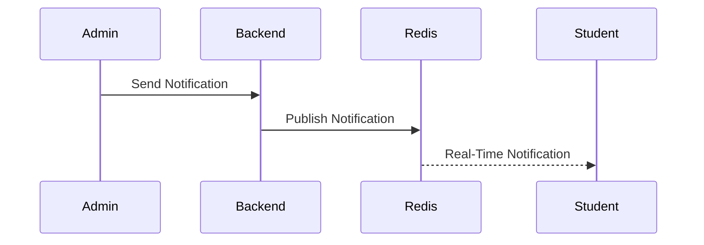
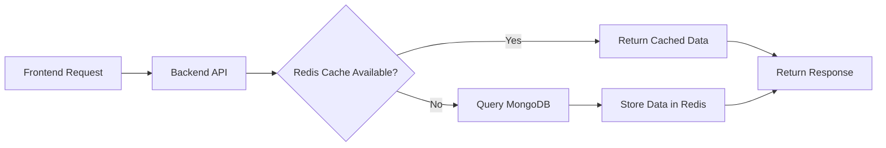

# CampusSync Diagrams

This document contains the Entity Relationship Diagram (ERD) and system flow diagrams used in the CampusSync project.

---

# Entity Relationship Diagram (ERD)

```mermaid
erDiagram

    USER {
        ObjectId _id
        string name
        string email
        string npm
        string password
        string role
        string photo
        date createdAt
        date updatedAt
    }

    CLASS {
        ObjectId _id
        string name
        ObjectId[] teachers
        ObjectId[] students
        date createdAt
        date updatedAt
    }

    SCHEDULE {
        ObjectId _id
        ObjectId class
        ObjectId teacher
        string description
        string classroom
        date startTime
        date endTime
        ObjectId createdBy
        date createdAt
        date updatedAt
    }

    MESSAGE {
        ObjectId _id
        ObjectId sender
        ObjectId[] recipients
        string msg
        date createdAt
        date updatedAt
    }

    USER }o--o{ CLASS : teaches
    USER }o--o{ CLASS : studies_in

    CLASS ||--o{ SCHEDULE : has
    USER ||--o{ SCHEDULE : teaches
    USER ||--o{ SCHEDULE : creates

    USER ||--o{ MESSAGE : sends
    MESSAGE }o--o{ USER : received_by

    USER ||--o{ NOTIFICATION : sends
    NOTIFICATION }o--o{ USER : received_by
```

---

# System Architecture Diagram



---

# Authentication Flow



---

# Notification Flow



---

# Cache Flow


